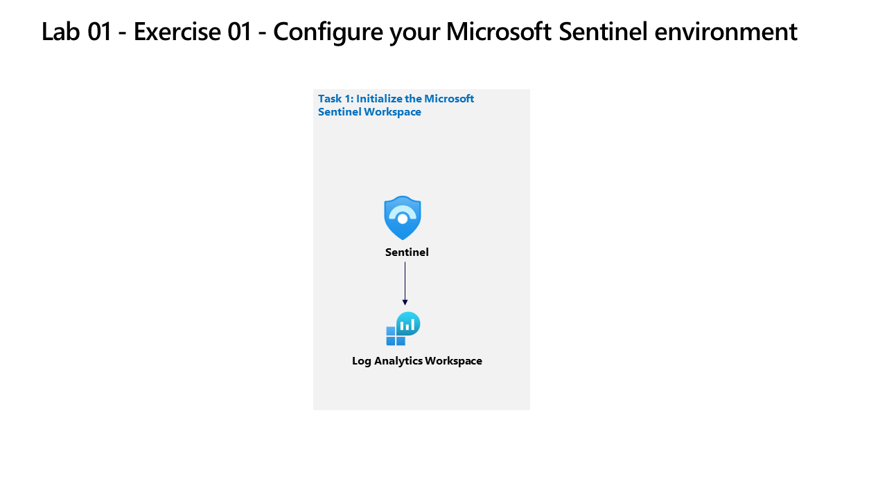

---
lab:
  title: "Ejercicio\_01: Implementar Microsoft\_Sentinel"
  module: Guided Project - Create and configure a Microsoft Sentinel workspace
---

>**Nota**: Para completar este laboratorio, necesitará una [suscripción de Azure](https://azure.microsoft.com/en-us/free/?azure-portal=true) en la que tenga acceso administrativo.

## Directrices generales

- Al crear objetos, use la configuración predeterminada a menos que haya requisitos que requieran configuraciones diferentes.
- Solo cree, elimine o modifique objetos para cumplir los requisitos indicados. Los cambios innecesarios en el entorno pueden afectar negativamente a la puntuación final.
- Si hay varios enfoques para lograr un objetivo, elija siempre el enfoque que requiere la menor cantidad de esfuerzo administrativo.

Actualmente estamos evaluando la posición de seguridad existente de nuestro entorno corporativo. Necesitamos su ayuda para configurar una solución de Administración de eventos e información de seguridad (SIEM) que ayude a identificar ataques cibernéticos actuales y futuros.

## Diagrama de la arquitectura

## Tareas de aptitudes

Debe implementar un área de trabajo de Microsoft Sentinel. El plan debe cumplir los requisitos siguientes:

- Asegúrese de que los datos de Sentinel se almacenan en la región de Azure del Oeste de EE. UU.
- Asegúrese de que todos los registros de análisis de Sentinel se conservan durante 180 días.
- Asigne roles a Operator1 para asegurarse de que Operator1 pueda administrar incidentes y ejecutar cuadernos de estrategias de Sentinel. La solución debe cumplir el principio de privilegios mínimos.

## Instrucciones del ejercicio

### Tarea 1: Crear un área de trabajo de Log Analytics

Cree un área de trabajo de Log Analytics, incluida la opción de región. Obtenga más información sobre [incorporar Microsoft Sentinel](https://learn.microsoft.com/azure/sentinel/quickstart-onboard).

  1. En Azure Portal, busque y seleccione `Microsoft Sentinel`.
  1. Seleccione **+ Create (+ Crear)**.
  1. Seleccione **Crear área de trabajo**.
  1. Seleccione `RG2` como Grupo de recursos
  1. Escriba un nombre válido para el área de trabajo de Log Analytics.
  1. Seleccione `West US` como la región para el área de trabajo.
  1. Seleccione **Revisar y crear** para validar el nuevo área de trabajo.
  1. Seleccione **Crear** para implementar el área de trabajo.

### Tarea 2: Implementar Microsoft Sentinel en un área de trabajo

Implemente Microsoft Sentinel en el área de trabajo.

  1. Cuando se complete la implementación `workspace`, seleccione **Actualizar** para mostrar el nuevo `workspace`.
  1. Seleccione el `workspace` al que desea agregar Sentinel (creado en la Tarea 1).
  1. Seleccione **Agregar**.

### Tarea 3: Asignar un rol de Microsoft Sentinel a un usuario.

Asigne un rol de Microsoft Sentinel a un usuario. Consiga más información sobre [Roles y permisos para trabajar en Microsoft Sentinel](https://learn.microsoft.com/azure/sentinel/roles)

  1. Vaya al Grupo de recursos RG2
  1. Seleccione **Control de acceso (IAM)**.
  1. Seleccione **Agregar ** y `Add role assignment`.
  1. En la barra de búsqueda, busque y seleccione el rol `Microsoft Sentinel Contributor`.
  1. Seleccione **Siguiente**.
  1. Seleccione la opción `User, group, or service principal`.
  1. Seleccione **+ Seleccionar integrantes**.
  1. Busque los `Operator1` asignados en las instrucciones del laboratorio `(operator1-XXXXXXXXX@LODSPRODMCA.onmicrosoft.com)`.
  1. Seleccione `user icon`.
  1. Elija **Seleccionar**.
  1. Seleccione “Revisar y asignar”.
  1. Seleccione “Revisar y asignar”.

### Tarea 4: Configurar la retención de datos

Configure la retención de datos [Más información sobre la retención de datos](https://learn.microsoft.com/azure/azure-monitor/logs/data-retention-archive).

  1. Vaya al `Log Analytics workspace` creado en la Tarea 1, paso 5.
  1. Seleccione **Uso y costos estimados**.
  1. Seleccione **Retención de datos**.
  1. Cambie el período de retención de datos a **180 días**.
  1. Seleccione **Aceptar**.

>**Nota**: Para más información, complete el módulo [Crear y administrar áreas de trabajo de Microsoft Sentinel](https://learn.microsoft.com/training/modules/create-manage-azure-sentinel-workspaces/).
