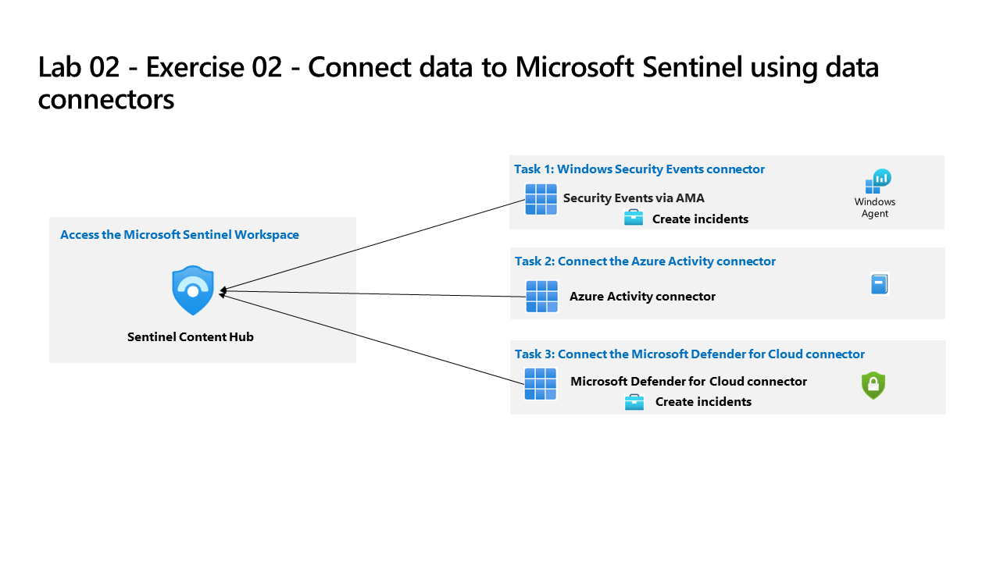

---
lab:
  title: 'Ejercicio 02: Ingesta de datos de eventos de Seguridad de Windows'
  module: Guided Project - Deploy Microsoft Sentinel Content Hub solutions and data connectors
---

>**Nota**: Este laboratorio se basa en el Laboratorio 01. Para completar este laboratorio, necesitará una [suscripción de Azure](https://azure.microsoft.com/free/?azure-portal=true). en la que tenga acceso administrativo.

## Directrices generales

- Al crear objetos, use la configuración predeterminada a menos que haya requisitos que requieran configuraciones diferentes.
- Solo cree, elimine o modifique objetos para cumplir los requisitos indicados. Los cambios innecesarios en el entorno pueden afectar negativamente a la puntuación final.
- Si hay varios enfoques para lograr un objetivo, elija siempre el enfoque que requiere la menor cantidad de esfuerzo administrativo.

Necesitamos configurar Microsoft Sentinel para ingerir datos mediante soluciones de Microsoft Sentinel.

## Diagrama de la arquitectura

## Tareas de aptitudes

Debe implementar soluciones del Centro de contenido en el área de trabajo de Microsoft Sentinel y cumplir los siguientes requisitos:

- Instale las siguientes soluciones:
  - Eventos de seguridad de Windows.
  - Conector de actividad de Azure.
  - Microsoft Defender for Cloud.
- Configure el conector de datos para la actividad de Azure para aplicar todos los recursos nuevos y existentes en la suscripción.
- Configure el conector de datos de Microsoft Defender for Cloud para conectarse a la suscripción de Azure y asegúrese de que solo está habilitada la sincronización bidireccional.
- Habilite una regla de análisis basada en la plantilla Número sospechoso de creación de recursos o actividades de implementación. La regla debe ejecutarse cada hora y solo buscar datos para esa última hora.
- Asegúrese de que el libro actividad de Azure esté disponible en Mis libros.

## Instrucciones del ejercicio

>**Nota**: En las siguientes tareas, para acceder a `Microsoft Sentinel`, seleccione el `workspace` que creó en el Laboratorio 01.

### Tarea 1: Implementar una solución del Centro de contenido de Microsoft Sentinel

Implemente una solución del Centro de contenido y configure conectores de datos. Obtenga más información sobre las [soluciones del Centro de contenido](https://learn.microsoft.com/azure/sentinel/sentinel-solutions).

1. En `Microsoft Sentinel`, vaya a la sección del menú `Content management` y seleccione **Centro de contenido**
1. Busque y seleccione **Eventos de Seguridad de Windows**
1. Seleccione el vínculo para **Ver detalles**
1. Seleccione plan de eventos de Seguridad de Windows y seleccione **Crear**
1. Seleccione el grupo de recursos `RG2` que incluye el área de trabajo de Microsoft Sentinel y seleccione el `Workspace`.
1. Seleccione **Siguiente** hacia la pestaña Conectores de datos (la solución implementará dos conectores de datos).
1. Seleccione **Siguiente** hacia la pestaña Libros (la solución instala libros)
1. Seleccione **Siguiente** hacia la pestaña Análisis (la solución instala reglas de análisis)
1. Seleccione **Siguiente** hacia la pestaña Búsqueda de consultas (la solución instala la búsqueda de consultas)
1. Seleccione **Revisar y crear**.
1. Seleccione **Crear**

1. Repita estos pasos para las soluciones `Azure Activity` y `Microsoft Defender for Cloud`.

### Tarea 2: Configurar el conector de datos para la actividad de Azure

Configure el conector de datos para la actividad de Azure para aplicar todos los recursos nuevos y existentes en la suscripción. Obtenga más información sobre los [conectores de datos de Microsoft Sentinel](https://learn.microsoft.com/azure/sentinel/connect-data-sources).

  1. En `Microsoft Sentinel`, vaya a la sección del menú `Content management` y seleccione **Centro de contenido**.
  1. En el `Content hub`, filtre `Status` por Soluciones instaladas.
  1. Seleccione la solución `Azure Activity` y seleccione **Administrar**.
  1. Seleccione el conector de datos `Azure Activity`y seleccione la página **Abrir conector**.
  1. En el área `Configuration`, bajo la pestaña `Instructions`, desplácese hacia abajo `2. Connect your subscriptions...` y seleccione **Iniciar el asistente de asignación de Azure Policy>**.
  1. En la pestaña **Datos básicos**, seleccione el botón de puntos suspensivos (...) en **Ámbito** y seleccione la suscripción de en la lista desplegable y haga clic en **Seleccionar**.
  1. Seleccione la pestaña **Parámetros** y elija el área de trabajo de la lista desplegable **Área de trabajo principal de Log Analytics**.
  1. Seleccione la pestaña **Corrección** y active la casilla **Crear una tarea de corrección**.
  1. Seleccione el botón **Revisar y crear** para revisar la configuración.
  1. Seleccione **Crear** para finalizar.
  
### Tarea 3: Configurar el conector de datos de Defender for Cloud

Configure el conector de datos de Microsoft Defender for Cloud y asegúrese de que solo esté configurada la administración de incidentes.

  1. En `Microsoft Sentinel`, vaya a la sección del menú `Content management` y seleccione **Centro de contenido**.
  1. En el `Content hub`, filtre `Status` por Soluciones instaladas.
  1. Seleccione la solución `Microsoft Defender for Cloud` y seleccione **Administrar**.
  1. Seleccione el conector de datos `Subscription-based Microsoft Defender for Cloud (Legacy)`y seleccione **Abrir la página del conector**
  1. En el `Configuration` área de la pestaña `Instructions`, desplácese hacia abajo hasta la suscripción y mueva el control deslizante de la columna `Status` a **Conectado**.
  1. Asegúrese de que `Bi-directional sync` esté **habilitado**.

### Tarea 4: Crear una regla de análisis

Cree una regla de análisis basada en la plantilla Número sospechoso de creación de recursos o actividades de implementación. La regla debe ejecutarse cada hora y solo buscar datos para esa última hora. Obtenga más información sobre [Usar plantillas de reglas de análisis de Microsoft Sentinel](https://learn.microsoft.com/azure/sentinel/detect-threats-built-in).

  1. En `Microsoft Sentinel`, vaya a la sección del menú `Configuration` y seleccione **Análisis**.
  1. En la pestaña `Rule templates`, busque **Número sospechoso de actividades de creación o implementación de recursos**.
  1. Seleccione el **número sospechoso de actividades de creación o implementación de recursos** y seleccione **Crear regla**.
  1. Deje los valores predeterminados en la pestaña `General` y seleccione **Siguiente: Establecer lógica de la regla >**.
  1. Deje el valor predeterminado `Rule query` y configure `Query scheduling` mediante la tabla:

     |Configuración |Valor|
     |---|---|
     |Ejecutar consulta cada|1 hora|
     |Buscar datos del último|1 hora|

  1. Seleccione **Siguiente: Configuración de incidentes >**.
  1. Deje los valores predeterminados y seleccione **Siguiente: Respuesta automatizada >**.
  1. Deje los valores predeterminados y seleccione **Siguiente: Revisar y crear >**.
  1. Seleccione **Guardar**.

### Tarea 5: Asegúrese de que el libro actividad de Azure esté disponible en Mis libros

  1. En `Microsoft Sentinel`, vaya a la sección del menú `Content management` y seleccione **Centro de contenido**.
  1. En el `Content hub`, filtre `Status` por Soluciones instaladas.
  1. Seleccione la solución `Azure Activity` y seleccione **Administrar**.
  1. Seleccione el libro `Azure Activity` `checkbox` y luego seleccione **Configuración**.
  1. Seleccione el libro `Azure Activity` y seleccione **Guardar**.
  1. Elija el `Azure Region` para el área de trabajo `Microsoft Sentinel`.  
