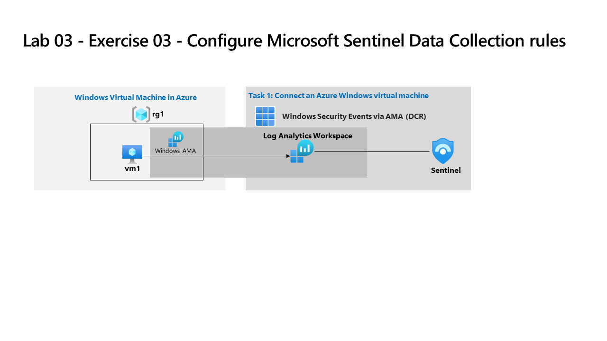

---
lab:
  title: 'Ejercicio 03: Validar la implementación de Sentinel'
  module: 'Guided Project - Configure Microsoft Sentinel Data Collection rules, NRT Analytic rule and Automation'
---

>**Nota**: Este laboratorio se basa en los Laboratorios 01 y 02. Para completar este laboratorio, necesitará una [suscripción de Azure](https://azure.microsoft.com/free/?azure-portal=true). en la que tenga acceso administrativo.

## Directrices generales

- Al crear objetos, use la configuración predeterminada a menos que haya requisitos que requieran configuraciones diferentes.
- Solo crea, elimina o modifica objetos para cumplir los requisitos indicados. Los cambios innecesarios en el entorno pueden afectar negativamente a la puntuación final.
- Si hay varios enfoques para lograr un objetivo, elija siempre el enfoque que requiere la menor cantidad de esfuerzo administrativo.

Es necesario configurar Microsoft Sentinel para recibir eventos de seguridad de máquinas virtuales que ejecutan Windows.

## Diagrama de arquitectura



## Tareas de aptitudes

Debe validar la implementación de Microsoft Sentinel para cumplir los siguientes requisitos:

- Configure los eventos de Seguridad de Windows a través del conector AMA para recopilar todos los eventos de seguridad solo de una máquina virtual denominada VM1.
- Cree una regla de consulta casi en tiempo real (NRT) para generar un incidente basado en la consulta siguiente.

```KQL
SecurityEvent 
| where EventID == 4732
| where TargetAccount == "Builtin\\Administrators"
```

- Cree una regla de automatización que asigne a Operator1 el rol Propietario para incidentes que genera la regla de NRT.

## Instrucciones del ejercicio

>**Nota**: En las siguientes tareas, para acceder a `Microsoft Sentinel`, seleccione el `workspace` que creó en el Laboratorio 01.

### Tarea 1: Configurar reglas de recopilación de datos (DCR) en Microsoft Sentinel

Configurar eventos de Seguridad de Windows a través del conector AMA. Consiga más información sobre los [eventos de Seguridad de Windows a través del conector AMA](https://learn.microsoft.com/azure/sentinel/data-connectors/windows-security-events-via-ama).

 1. En `Microsoft Sentinel`, vaya a la sección del menú `Configuration` y seleccione **Conectores de datos**
 1. Busque y seleccione **Eventos de Seguridad de Windows a través de AMA**
 1. Seleccione **Abrir página del conector**
 1. En el área `Configuration`, seleccione **+Crear regla de recopilación de datos**
 1. En la pestaña `Basics` escriba un `Rule Name`
 1. En la pestaña `Resources` expanda la suscripción y el grupo de recursos `RG1` de la columna `Scope`
 1. Seleccione `VM1` y, a continuación, seleccione **Siguiente: Recopilar >**
 1. En la pestaña `Collect`, deje el valor predeterminado de `All Security Events`
 1. Seleccione **Siguiente: Revisar y crear >** y, después, seleccione **Crear**

### Tarea 2: Crear una detección de consultas casi en tiempo real (NRT)

Detecte amenazas con reglas de análisis casi en tiempo real (NRT) en Microsoft Sentinel. Más información sobre las [reglas de análisis casi en tiempo real en Microsoft Sentinel](https://learn.microsoft.com/azure/sentinel/near-real-time-rules).

 1. En `Microsoft Sentinel`, vaya a la sección del menú `Configuration` y seleccione **Análisis**
 1. Seleccione **+ Crear** y **regla de consulta casi en tiempo real (Versión preliminar)**
 1. Escriba un `Name` para la regla y seleccione **Elevación de privilegios** en `Tactics and techniques`.
 1. Seleccione **Siguiente: Establecer la lógica de la regla >**
 1. Escriba la consulta KQL en el formulario `Rule query`

    ```KQL
    SecurityEvent 
    | where EventID == 4732
    | where TargetAccount == "Builtin\\Administrators"
    ```

 1. Seleccione **Siguiente: Configuración de incidentes >** y seleccione **Siguiente: Respuesta automatizada >**
 1. Seleccione **Siguiente: Revisar y crear**.
 1. Una vez completada la validación, seleccione **Guardar**

### Tarea 3: Configurar la automatización en Microsoft Sentinel 

Configure la automatización en Microsoft Sentinel. Obtenga más información sobre [crear y usar reglas de automatización de Microsoft Sentinel](https://learn.microsoft.com/azure/sentinel/create-manage-use-automation-rules).

 1. En `Microsoft Sentinel`, vaya a la sección del menú `Configuration` y seleccione **Automatización**
 1. Seleccione **+ Crear** y regla de automatización
 1. Escriba un `Automation rule name` y seleccione **Asignar propietario** desde `Actions`
 1. Asigne **Operator1** como propietario.
 1. Seleccione **Aplicar**.
