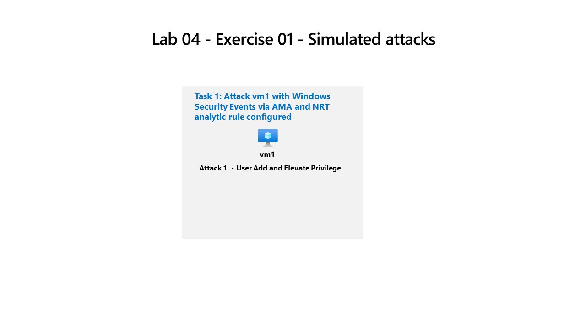

---
lab:
  title: 'Ejercicio 04: Realizar un ataque simulado'
  module: Guided Project - Perform a simulated attack to validate Analytic and Automation rules
---

>**Nota**: Este laboratorio se basa en los Laboratorios 01, 02 y 03. Para completar este laboratorio, necesitará una [suscripción de Azure](https://azure.microsoft.com/free/?azure-portal=true). en la que tenga acceso administrativo.

## Directrices generales

- Al crear objetos, use la configuración predeterminada a menos que haya requisitos que requieran configuraciones diferentes.
- Solo crea, elimina o modifica objetos para cumplir los requisitos indicados. Los cambios innecesarios en el entorno pueden afectar negativamente a la puntuación final.
- Si hay varios enfoques para lograr un objetivo, elija siempre el enfoque que requiere la menor cantidad de esfuerzo administrativo.

Se necesita validar que la implementación de Microsoft Sentinel recibe eventos de seguridad y crea incidentes a partir de máquinas virtuales que ejecutan Windows.

## Diagrama de arquitectura



## Tareas de aptitudes

Deberá realizar un ataque simulado para validar que las reglas de análisis y de automatización crean un incidente y lo asignan al `Operator1`. Realizará un ataque simple `Privilege Escalation` en `vm1`.

## Instrucciones del ejercicio

### Tarea 1: Realizar un ataque simulado de elevación de privilegios

Use ataques simulados para probar reglas de análisis en Microsoft Sentinel. Obtenga más información sobre la [simulación de ataques de elevación de privilegios](https://github.com/redcanaryco/atomic-red-team/blob/master/atomics/T1078.003/T1078.003.md).

1. Busque y seleccione la máquina virtual **vm1** en Azure, desplácese hacia abajo en los elementos del menú hasta **Operaciones** y seleccione **Ejecutar comando**
1. En el panel **Ejecutar comando**, seleccione **RunPowerShellScript**
1. Copia los comandos siguientes para simular la creación de una cuenta de administrador en el formulario `PowerShell Script` y selecciona **Ejecutar**

    ```CommandPrompt
    net user theusernametoadd /add
    net user theusernametoadd ThePassword1!
    net localgroup administrators theusernametoadd /add
    ```

>**Nota**: asegúrate de que solo haya un comando por línea y que puedes volver a ejecutar los comandos cambiando el nombre de usuario.

1. En la ventana `Output` debería ver `The command completed successfully` tres veces

### Tarea 2: Comprobar que se crea un incidente a partir del ataque simulado

Compruebe que se crea un incidente que coincida con los criterios de la regla de análisis y la automatización. Obtenga más información sobre la [administración de incidentes de Microsoft Sentinel](https://learn.microsoft.com/azure/sentinel/incident-investigation).

1. En `Microsoft Sentinel`, vaya a la sección del menú `Threat management` y seleccione **Inicidentes**
1. Deberías ver un incidente que coincida con y `Severity``Title` que has configurado en la regla `NRT` que has creado
1. Selecciona y `Incident` se abrirá el panel `detail`
1. La asignación `Owner` debe ser **Operator1**, creada a partir de `Automation rule` y `Tactics and techniques` debe ser **Elevación de privilegios** (a partir de la regla `NRT`)
1. Seleccione **Ver todos los detalles** para ver todas las `Incident management` capacidades y `Incident actions`
